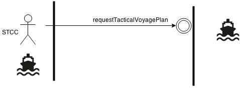

= Message Exchange for Flow Management in Maritime Traffic Management Systems using the Maritime Cloud.
Niels Bech Nielsen <nbn@logical.dk>
v0.1, January 6, 2015: First draft
:keywords: imo, iala, mms, dma, monalisa, maritime cloud
:toc-placement: preamble
:icons: font
:servicedir: ../../../../../Services/
:msdlfiles: {servicedir}/src/main/msdl/eu/monalisaproject/

Prepared by the http://dma.dk[Danish Maritime Authority] as part of the http://monalisaproject.eu/[MONA LISA 2] project.

image::images/dma.png[align="center", scaledwidth="25%"]
image::images/monalisa2.png[align="center"]
image::images/eu.png[align="center"]

[cols="1,2,4,4"]
|===
|v0.1 |08 JAN 2015 |Niels Bech Nielsen <nbn@logical.dk> |First draft.
|===

[abstract]
== Abstract
...

:numbered:

== Introduction
As part of -- and as a contribution to -- the MONA LISA 2.0 <<MONALISA2>> project, the Danish Maritime Authority has worked to define message conversation scenarios and detailed message formats for _flow management_ in the context of _sea traffic management (STM)_ as defined by <<ARCH>>.

The results contain inputs, contributions, and insights from DMA and project partners.

This paper documents the process and the results, by

. defining the domain problem,
. establishing a set of use cases for the domain,
. defining message formats for use case interaction,
. introducing a reference implementation, and by 
. supplying test data to validate its correctness.

The official point of contact for questions and comments is:

.Point of contact
****
Danish Maritime Authority +
_Dept. of Technology and Business Development_

M.Sc. Jens Kristian Jensen <JKJ@dma.dk>
****

=== Problem definition

==== Flow management
As defined by <<ARCH>> flow management is communication which takes place between ships in a peer-to-peer situation, or between ships and a coordinating organisation (e.g. VTS, STCC) in order to:

1. Increase safety and prevent delays through a good flow in narrow channels with high traffic density
2. Support vessel in arriving at final destination in due time as efficient as possible
3. Provide information to interested parties about planned and predicted time of arrival to final destination or other point of interest.

For item 1 the term "good" means that collisions and dangerous situations are avoided and that vessels can safely follow their announced tactical voyage plan through the area.

Flow _management_ is based on knowledge of vessels' tactical voyage plans; i.e. announcements from each vessel regarding their intended manouvers in the immediate short-term future. When this knowledge is known either centrally at a coordinating center or distributed between nearby vessels, it is possible for the coordination centre or the nearby vessels to suggest and negotiate tactical voyage plans to obtain a "good" flow. It is this process which is called _flow management_.

If flow management takes place in a self-organizaing manner between vessels on a peer-to-peer basis it is called _autonomous flow management_. When a coordinating center is performing flow management the process is called _controlled flow management_. In a fully managed scenario -- whether autonomous or controlled -- all vessels can safely and efficiently follow their tactical voyage plans through their entire passage of the area.

===== Intension and Tactical Voyage Plan
In order to facilitate flow management vessels participate by providing intentions as well as tactical voyage plans. A tactical voyage plan is a subset of the Dynamic Voyage Plan and contains the immediate upcoming waypoints and their schedule.

===== Flow Management Suggestion
A suggested change to a tactical voyage plan is called a _flow management suggestion_. A flow management suggestion can be transmitted from either a coordination centre or a peer vessel. It can take one of two principal forms:

1. Geometry-based (adding, deleting or changing waypoints)
2. Speed-based (not changing any waypoints)

Changing the geometry of a tactical voyage plan is a relatively complex operation for the vessels navigator. Among other things the process involves a safety check of the new route and re-programming of navigational equipment. The cost/workload of this operation reduces the likelihood of a vessel complying with suggested changes.

Changing the vessels speed (or waypoint ETA's) is a far simpler operation for the navigator. This involves only adjustment of the vessels speed and recalculation of the wheel-over-point in advance of each waypoint. It is therefore expected, that the likelihood of a of vessel complying with a suggested change of this type is higher than suggested changes to geometry.

==== Controlled flow management
Controlled flow management always takes place inside a defined geographical area called the _controlled area_. The controlled area is a closed polygon.

Vessels can be located inside the controlled area -- or outside the controlled area.

Vessels outside the controlled area can be in state

- _entering_ -- meaning that the vessel intends to enter the controlled area.

Vessels inside the controlled area can be in states

- _leaving_ -- meaning that the vessel intends to leave the controlled area.
- _staying_ -- meaning that the vessel intends to seek berth, drop anchor, or elsehow keep manouvering inside the area.

Some of the vessels are aware of some of the other vessels tactical voyage plans, and the coordination centre is aware of some of the vessels tactical voyage plans.

The coordination centre is continuously receiving an AIS data stream, including type 1-3 position messages and type 5 ship and static voyage messages, so that it can maintain an updated real-time picture of the current traffic situation. 

[[img-controlled-area]]
.A controlled area and five vessels showing their intended routes. There are vessels outside (1, 2) and vessels inside (3-5) the controlled area. A vessel (2) is entering, a vessel is leaving (3), and two vessels are staying (4 ,5).
image::images/controlled_area.png[img-controlled-area, align="center"]

==== Autonomous flow management
...

==== Maritime Cloud

The Maritime Cloud <<MARCLOUD>> is defined as “A communication framework enabling efficient, secure, reliable and seamless electronic information exchange 
between all authorized maritime stakeholders across available communication systems” and contains

. A Maritime Identify Registry
. A Maritime Service Portfolio Registry
. A Maritime Messaging Service (MMS)

[[img-mar-cloud]]
.The Maritime Messaging Service enable vessels and stakeholders to provide services in a secure exchange
image::images/maritimecloud.png[img-mar-cloud, align="center"]

Vessels, STCC and other stakeholders may enable a service by providing an _endpoint_ which can be queried. Requests may be initiated from any stakeholder by invocation of the _endpoint_.

Vessels, STCC and other stakeholders may also choose to _broadcast_ a set of messages. Messages may be geo-located to a specific area.

Service endpoints and broadcast messages are described in a specific Maritime Service Descriptor Language (MSDL).

=== Scope of work
The scope of the work in this paper is _controlled flow management in a limited area (managed by an STCC) based on flow management suggestions using maritime cloud services_.

The objective is to define _which_ information (i.e. messages) that need to be exchanged and to define the criteria/triggers for _when_ this information is transmitted.

The outcome is a set of message definitions, endpoints, test data, and a reference implementation to support controlled flow management.

The interaction is specified in <<ARCH>> chapter 10 - Core Services, and include all interaction between vessel and STCC using MMS.

[[use_cases]]
== Use cases

=== Use cases for controlled flow management

The use cases presented in this chapter are specified in <<ARCH>> chapter 10 - Core Services. Although the chapter contains other services, the use cases presented here
are all made available through MMS.

==== Use case: Requesting a tactical voyage plan

{set:step:0}
[cols="1,5"]
.Use case.
|===
| {counter:step} | The STCC detects that a vessel approaches or has already entered the controlled area.
| {counter:step} | The vessel receives a request for a tactical voyage plan.
The request specifies the time interval of the tactical voyage plan as a configurable time window (Default five hours).
| {counter:step} | The vessel check that it wish to communicate the tactical voyage plan with the requestor.
| {counter:step} | The vessel responds with a tactical voyage plan.
| *Exception*    | Requestor may not be a coordination centre. Vessel may choose not to disclose the tactical voyage plan.
| *Exception*    | The vessel may not have a tactical voyage plan at present.
|===

==== Use case: Vessel receive flow management suggestion

{set:step:0}
[cols="1,5"]
|===
| {counter:step} | The vessel receive a flow management suggestion from the coordination centre.
| {counter:step} | The vessel acknowledge the receipt of the suggestion.
| {counter:step} | The officer on watch (OOW) verify the proposal.
.4+| {counter:step} | If the vessel accepts the proposal:
                 | -- The vessel update the dynamic voyage plan if needed. Any changes to the route or schedule will result in an update being sent to the STCC.
				 | -- The vessel respond with approval message.
				 | -- The vessel starts broadcasting new tactical voyage plan via AIS.
.2+| {counter:step} | If the vessel does not accept the proposal:
                    | -- The vessel respond with a rejection message.				 
| *Exception* | The vessel do not respond to the flow management suggestion.
|===

[[messageformat]]
== Message and Endpoint definitions

Communication in MMS is specified through endpoint and broadcasts. In order to support the use cases, there is currently no particular need for broadcast, so this chapter outlines the endpoint definitions as well as the message formats.

Details of the service definitions is described in the Maritime Cloud Developer Guide, which is published online <<MARCLOUDDEV>>.

=== MMS endpoints

==== Tactical Voyage Plan Exchange

One endpoint method is defined for an exchange of a tactical voyage plan.

[[img-tvp-exchange]]
.Requesting a Tactical Voyage Plan through defined endpoint.

STCC, a ship or another entity may request a tactical voyage plan from the endpoint. The request must specify the amount of minutes into the near future for the voyage plan.

The ship responds with the tactical voyage plan or rejects if it cannot comply.

====
Q? 

* Should zero or negative timeWindow cause rejection or empty response or even default response? 
* Is there a max time window to not call it tactical anymore?  
* Can the ship just return a shorter timespan if it does not have/want to publish more?
====

In MSDL the endpoint definition should look like this:

[source]
.Endpoint definition in MSDL
----
include::{msdlfiles}/tacticalVoyagePlanExchange.msdl[tags=tvpendpoint]

include::{msdlfiles}/tacticalVoyagePlanExchange.msdl[tags=tvpresponse]
----

The response include a tactical voyage plan and a message for any explanation.

====
Q?

* What's the best way to signal errors or non-comply or limited-comply or other..?
* Should we include a response type (ACCEPT | REJECT | something...)
* Should we provide a unique identification of a tactical voyage plan (like a UUID, in case where we need to reference this specific tvp again)?
====

==== Flow Management Suggestion Exchange

Two endpoint methods are defined for flow management suggestions. One method for posting the suggestion and another endpoint method for the response.

[[img-flow-suggest]]
.Suggesting a Tactical Voyage Plan through defined endpoint.
image::images/endpoint-flow.png[img-flow-suggest, align="center"]

The asynchronous nature of the conversation allows the vessel to verify the suggestion before deciding upon further action. 

Similar to the tactical voyage plan exchange the interaction can be ship to ship and ship to shore. The ship to ship scenario would enable Autonomous flow management.

The endpoints will be defined in MSDL like this:
[source]
.Endpoint definition in MSDL
----
include::{msdlfiles}/flowManagementSuggestion.msdl[tags=flowendpoint]
----

The request and response are both of particular types containing relevant information about the request and response.

[source]
----
include::{msdlfiles}/flowManagementSuggestion.msdl[tags=flowRequest]
----

When a suggestion is submitted it contains apart from the tactical voyage plan a transaction identifier for parties to identify this particular request at a later time. The same identifier will be used in responses but also in case of re-transmission.

The request also includes an optional message for the ship to understand the reason behind the suggestion.

[source]
----
include::{msdlfiles}/flowManagementSuggestion.msdl[tags=flowResponse]
----

The response include the original transaction identifier from the request. It also includes a status of the suggestion request, most particularly if the request has been accepted or rejected.

The return status of _PENDING_ can be used as an intermediate response in cases where a decision has not been met yet. The ship can implement an automated response with _status=PENDING_ at regular intervals.

==== Tactical Voyage Plan

The tactical voyage plan is a subset of the Dynamic Voyage Plan and contain route geometry and the near schedule.

It is based on the defined format in <<ARCH>> - Appendix A, however, some optional fields have been omitted for the tactical scenario.

A tactical voyage plan is returned by a ship when requested, but is also used for flow management suggestions. In the latter case the tactical voyage plan should be structural identical to the tactical voyage plan requested, but will differ only in the change content, such as waypoint position, speed, etd, eta, etc. 

[source]
----
include::{msdlfiles}/tacticalVoyagePlan.msdl[tags=tvpmessage]
----

Each tactical voyage plan have a route name which is mandatory in the Dynamic Voyage Plan. Otherwise the message contains the route geometry as a list of waypoints and a schedule.

The waypoints should be represented in order with the active waypoint as the first waypoint in the list.

The schedule information defines the current schedule between endpoints and is sorted by time.

===== Waypoint definition

Each waypoint contains the following definition

[source]
----
include::{msdlfiles}/tacticalVoyagePlan.msdl[tags=tvpwaypoint]
----

The waypoint ID refer to the waypoint ID from the Dynamic Voyage Plan. Each waypoint have a given position and a turn radius, when part of a direction change.

All but the first waypoint should have a leg definition of the inbound leg.

===== Leg definition

Each leg contains the following definition

[source]
----
include::{msdlfiles}/tacticalVoyagePlan.msdl[tags=tvpleg]
----

Each leg define the cross track distance in meters for starboard and port as well as the geometry type of the leg. Default geometry type is loxodrome.

===== Schedule definition

Each schedule contains the following definition

[source]
----
include::{msdlfiles}/tacticalVoyagePlan.msdl[tags=tvpschedule]
----

Each schedule element contains a reference to the departing waypoint and the arriving waypoint, matching the identifier in the waypoint list.

Schedules are defined in time order, which means that the calculated and the manual schedule elements of the Dynamic Voyage Plan is merged into one with a subsequent schedule type attached.

The schedule contains an ETD of the departing waypoint as well as an ETA of the arriving waypoint. When there is no significant stop-over at a waypoint the ETD may be omitted and merely substituted by the ETA of the previous schedule.

The schedule element also contains the speed over ground in knots as an easy indication of - but no substitution for - the arrival at the upcoming waypoint.

[glossary]
== Glossary

=== Definitions

[cols="1,6"]
|===
|Term |Definition

|Strategic voyage plan | MONALISA 2 term for long term planning that consists of a route with a voyage number (and other Route information), a list of waypoints (geometry), a schedule, charter parties, legal conditions, and more. When a Strategic voyage plan is given to the ship as a voyage order it changes to _dynamic voyage plan_.
|Dynamic voyage plan | MONALISA 2 term for an optimised version of the _strategic voyage plan_
|Tactical voyage plan | MONALISA 3 term for a dynamic voyage plan in conning mode; i.e. under tactical execution. Whole or parts of the tactical voyage plan can be transmitted to increase situational awareness and support flow management.
|===

=== Abbreviations

[cols="1,3,3"]
|===
|Abbreviation |Expansion | Description

|MSDL |Maritime Service Definition Language | A computer language used to defined services in the maritime cloud
|MMS |Maritime Messaging Service | Exchange of messages through the maritime cloud 
|AIS |Automatic Identification System |A tracking system used on ships and by vessel traffic services for identifying and locating vessels by electronically exchanging data with other nearby ships, base stations, and satellites.
|STM |Sea Traffic Management |The aggregation of the seaborne and shore-based functions (sea traffic services, maritime space management and sea traffic flow management) required to ensure the safe and efficient manouvering of vessels during all phases of operation.
|STCC |Sea Traffic Coordination Center |A central, shore-based, hub maintaining record of all vessels at sea using AIS and/or radar to enable managed distribution of vessel routes between ship-to-ship and ship-to-shore.
|VTS |Vessel traffic service |A vessel traffic service is a marine traffic monitoring system established by public or port authorities, somewhat similar to air traffic control for aircraft.
|IALA |International Association of Lighthouse Authorities |The International Association of Marine Aids to Navigation and Lighthouse Authorities is a non-profit organization founded collect and provide nautical expertise and advice.
|ITU |International Telecommunication Union |The International Telecommunication Unio is an agency of the United Nations that is responsible for issues that concern information and communication technologies, such as coordinating the shared global use of the radio spectrum, promoting international cooperation in assigning satellite orbits, assisting in the development of worldwide technical standards.
|ASCII |American Standard Code for Interformation Interchange | A character encoding scheme used in computers, communications equipment, and other devices that use text, to represent text with numbers.
|ETA |Estimated time of arrival |-
|ETC |Estimated time of departure |-
|SOG |Speed over ground |Speed made good measured in knots.
|OOW |Officer on watch |-
|===

[bibliography]
== Bibliography

=== Standards and specifications

=== Articles and papers

[[[ARCH]]] "Architecture for STM in EMSN and STM Data format for Route Exchange".

=== Web resources

[[[MONALISA2]]] "MONALISA 2.0". A joint project from 10 different countries in the European Union to introduce Sea Traffic Management (STM) and make real-time information available to all interested and authorised parties in the maritime world. http://monalisaproject.eu/.

[[[MARCLOUD]]] Maritime Cloud. A framework consisting of standards, infrastructure and governance that fascilitate secure interoperable information exchange between stakeholders in the maritime community using the principles of Service Oriented Architectures. http://www.maritimecloud.net/.

[[[MARCLOUDDEV]]] Marimtime Cloud Developer Guide. A guide for developers using the maritime cloud. Also includes a section on current MSDL. http://dev.maritimecloud.net/devguide/index.html#mms-and-services.