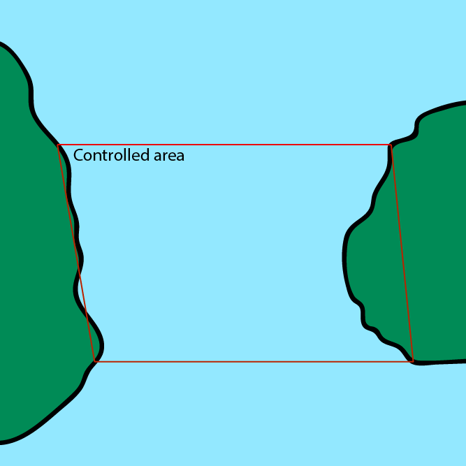

= Message exchange for flow management in maritime traffic management systems.
Thomas Borg Salling <tbsalling@tbsalling.dk>
v0.0, January 6, 2015: First draft
:keywords: imo, iala, ais, itu-r-1371, monalisa, ten-t
:toc-placement: preamble
:icons: font

Prepared by the http://dma.dk[Danish Maritime Authority] as part of the http://monalisaproject.eu/[MONA LISA 2] project.

image::images/dma.png[align="center", scaledwidth="25%"]
image::images/monalisa2.png[align="center"]
image::images/eu.png[align="center"]

[cols="1,2,4,4"]
|===
|v0.0 |06 JAN 2015 |Thomas Borg Salling <tbsalling@tbsalling.dk> |First draft.
|===

[abstract]
== Abstract
...

:numbered:

== Introduction
As part of -- and as a contribution to -- the MONA LISA 2.0 <<MONALISA2>> project, the Danish Maritime Authority has worked to define message conversation scenarios and detailed message formats for _flow management_ in the context of _sea traffic management (STM)_ as defined by <<ARCH>>.

The results contain inputs, contributions, and insights from DMA and project partners.

This paper documents the process and the the results, by

. defining the domain problem,
. setting the scope of work,
. establishing design criteria,
. proposing message conversation scenarios,
. defining message formats in different formats,
. validating message formats against desig criteria,
. introducing a reference implementation for AIS using application specific messages, and by
. supplying test data to validate its correctness.

The official point of contact for questions and comments is:

.Point of contact
****
Danish Maritime Authority +
_Dept. of Technology and Business Development_

M.Sc. Jens Kristian Jensen <JKJ@dma.dk>
****

=== Problem definition

==== Flow management
As defined by <<ARCH>> flow management is communication which takes place between ships in a peer-to-peer situation, or between ships and a coordinating organisation (e.g. VTS, STCC) in order to:

1. Increase safety and prevent delays through a good flow in narrow channels with high traffic density
1. Support vessel in arriving at final destination in due time as efficient as possible
1. Provide information to interested parties about planned and predicted time of arrival to final destination or other point of interest.

For item 1 the term "good" means that collisions and dangerous situations are avoided and that vessels can safely follow their announced intended movements through the area.

Flow _management_ is based on knowledge of vessels' intended movements; i.e. announcements from each vessel regarding their intended manouvers in the short-term future. When this knowledge is known either centrally at a coordinating center or distributed between nearby vessels, it is possible for the coordination centre or the nearby vessels to suggest and negotiate intended movements to obtain a "good" flow. It is this process which is called _flow management_.

If flow management takes place in a self-organizaing manner between vessels on a peer-to-peer basis it is called _autonomous flow management_. When a coordinating center is performing it the process is called _controlled flow management_. In a fully managed scenario -- whether autonomous or controlled -- all vessels can safely and efficiently follow their intended movements through their entire passage of the area.

===== Intended movements
In order to facilitate flow management vessels in the area must transmit their intended movements (waypoints and ETA's) and basic information concerning their manouvering capabilities.

===== Suggested movements
A suggested change to an intended movement is called a _suggested movement_. A suggested movement can be transmitted from either a coordination centre or a peer vessel. It can take one of two principal forms:

1. Geometry-based (adding, deleting or changing waypoints)
1. Speed-based (not changing any waypoints)

Changing the geometry of an intended movement is a relatively complex operation for the vessel's navigator. Among other things the process involves a safety check of the new route and reprogramming of navigational equipment. The cost/workload of this operation reduces the likelihood of a vessel complying with suggested changes.

Changing the vessel's speed (or waypoint ETA's) is a far simpler operation for the navigator. This involves only adjustment of the vessel's speed and recalculation of the wheel-over-point in advance of each waypoint. It is therefore expected, that the likelihood of a of vessel complying with a suggested change of this type is higher than suggested changes to geometry.

==== Controlled flow management
Controlled flow management always takes place inside a defined geographical area called the _controlled area_. The controlled area is a closed polygon.

Vessels can be located inside the controlled area -- or outside the controlled area.

Vessels outside the controlled area can be in state

- _entering_ -- meaning that the vessel intends to enter the controlled area.

Vessels inside the controlled area can be in states

- _leaving_ -- meaning that the vessel intends to leave the controlled area.
- _staying_ -- meaning that the vessel intends to seek berth, drop anchor, or elsehow keep manouvering inside the area.

Some of the vessels are aware of some of the other vessels' intended movements, and the coordination centre is aware of some of the vessel's intended movements.

The coordination centre is continuously receiving an AIS data stream, including type 1-3 position messages and type 5 ship and static voyage messages, so that it can maintain an updated real-time picture of the current traffic situation.

[[img-controlled-area]]
.A controlled area and five vessels showing their intended routes. There are vessels outside (1, 2) and vessels inside (3-5) the controleld area. A vessel (2) is entering, a vessel is leaving (3), and two vessels are staying (4 ,5).

==== Autonomous flow management
...

=== Scope of work
The scope of the work in this paper is flow management - both controlled and autonomous; but limited to suggested movements in the speed-based form.

The objective is to define _which_ information (i.e. payload, data fields) that need to be exchanged and to define the criteria/triggers for _when_ this information is transmitted.

The outcome is a set of message definitions, transmission criteria, test data, and a reference implementation to support controlled and autonomous flow management.

[[use_cases]]
== Use cases

=== Use cases for controlled flow management

==== Use case: Vessel enters the controlled area

{set:step:0}
[cols="1,5,5"]
.Use case.
|===
| No. | Event | Action

| {counter:step} | The coordination centre detects, that a vessel has entered the controlled area. | The control centre transmits an addressed message to the vessel requesting it broadcast intended movements.footnote:[This is done even if the coordination centre already has this information in order to distribute this information to other vessels in the area.]
| {counter:step} | The vessel receives the message. | The vessel responds by broadcasting message, which contains its intended movements.
.2+| {counter:step} | The broadcast is received by the coordination centre (and likely some of the other vessels in the area). | The control centre recalculates optimal speeds per vessel.footnote:[with priority to suggest speed changes for V~0~ over other vessels, and fewest possible other vessels, and only for vessels intending to leave A.]
   | *Exception:* The broadcast is never received by the coordination centre. | The coordination centre retransmits its message to the vessel.
| {counter:step} | The coordination centre's recalculation of optimal speeds completes. | The coordination centre transmits an addressed messages with suggested movements to those vessels which (according to the calculation) require changes.
.2+| {counter:step} | A vessel receives its suggested movement from the coordination centre. | The navigator is alerted.
| *Exception:* The suggsted movement is never received by the vessel. | _May lead to special case: Coordination centre discovers new suggestions needed._
| {counter:step} | Navigator of approves suggested movement. | The vessel broadcasts a message containing its new intended movement.
|===

==== Use case: Coordination centre determintes new suggested movements needed

{set:step:0}
[cols="1,5,5"]
.Use case.
|===
| No. | Event | Action

| {counter:step} | The coordination centre detects that the current flow is not optimal ("good") | The control centre recalculates optimal speeds per vessel.
| {counter:step} | The coordination centre's recalculation of optimal speeds completes. | The coordination centre transmits an addressed messages with suggested movements to those vessels which (according to the calculation) require changes.
.2+| {counter:step} | A vessel receives its suggested movement from the coordination centre. | The navigator is alerted.
| *Exception:* The suggsted movement is never received by the vessel. | _May lead to special case: Coordination centre discovers new suggestions needed._
| {counter:step} | Navigator of approves suggested movement. | The vessel broadcasts a message containing its new intended movement.
|===

==== Use case: A vessel suggests intended movement for another vessel
(in a controlled flow management scenario)

...

=== Use cases for autonomous flow management

...

== Design criteria
Messaging in the maritime domain has been available many years and communication standards have evolved and been added and augmented several times to accomodate the increasing demand for handling more and more complex scenarios in the maritime domain.

When suggesting message exchange for advanced use cases, such as for flow management, we want to take lessons learned from the past years into account. Literature, has as <<TOILS>>, has therefore been studied to establish a set of design criteria for the messages that are defined for flow management.

In section <<design_validation>> it will be validated, that the suggested messages layouts and payloads are in compliance with these design criteria.

=== General design criteria

==== Design with the end-user in mind
In accordance with <<ARCH>>, §3, all systems shall be designed with the end user (e.g. mariner, ship owner, operator), in mind.

====
This shall be achieved, by carefully identifying and defining use cases expressed in user domain terms and approved by user domain experts (such as navigators) before the actual design of message conversations and message layouts takes place.
====

==== Design for multivendor environment
In accordance with <<ARCH>>, §3 p.6, one of the main goals (here interpreted as _design criteria_) of the MONALISA 2.0 project is to "achieve full and seamless interoperability of systems in Sea Traffic Management (STM) [...] in a multi-vendor environment".

====
This shall be achieved by ensuring that relevant stakeholders in government and industry can contribute to and review the design of conversations and messages in flow management.
====

==== Information transfer involving ships must be bandwidth efficient
In accordance with <<ARCH>>, §7 p.23, information transfer involving ships must be highly bandwidth efficient.

====
This shall be achieved by designing messages to be as compact as possible, avoiding redundant information in message layouts, and using bit-level compression where applicable and possible.
====

==== Ship-shore interactions must be robust
In accordance with <<ARCH>>, §7 p.23, ship-shore interactions must be robust to unstable, changing, high latency links.

====
This shall be achieved by ???
====

==== Ship-shore data IP connections must be initiated from ship
In accordance with <<ARCH>>, §7 p.23, ship-shore data connections must be initiated from ship, to address cyber security.

====
This shall be achieved by designing the required mechanisms of communication, such that ship-to-shore communication is based on IP-based connection-oriented communication (e.g. TCP/IP), then such a connection can only be initiated from the ship-side.
====

=== AIS-specific design criteria

==== Consider updated definitions of ASM and related guidance, before developing new ASM;
In accordance with <<IALA144>>, recommendation 4, IALA recommends that members make use of the IALA ASM collection <<AISASM>> by taking into account other updated definitions of ASM and related guidance, before developing new or implementing the use of existing Regional ASM.

====
This shall be achieved by consulting the ASM collection <<AISASM>> to ensure that no other existing ASM already fulfills the requirements of any newly designed message before it is submitted for approval.
====

==== Contribute to the IALA AIS ASM collection
In accordance with <<IALA144>>, recommendation 6, members are recommended to contribute to the IALA ASM collection through their National IALA Member.

====
This shall be achieved by ensuring that the final and agreed ASM messages to support flow management are submitted to the IALA ASM collection by the national IALA member, in this case the Danish Maritime Authority.
====

==== Low transmission frequency
In accordance with <<AISG289>>, §3.3, the frequency of message transmission should be limited in order to prevent system overload.

====
This shall be achieved by careful design of the criteria which trigger a message transmission, in order to minimise the number of transmissions to the lowest possible.
====

==== Limit no. of VHF transmission slots
In accordance with <<AISG289>>, §3.4, AIS messages occupying more than three (3) slots should be avoided, unless there is a low load on the VDL or a compelling reason to do so.

====
This shall be achieved by designing messages to avoid occupying more than 3 slots.
====

==== Use 6-bit ASCII
As pointed out by <<TOILS>> the decision to use 6-bit ASCII encoding in AIS messages is a _blunder_. But as it states: "Some major defects, such as the handling of string data, are too deeply embedded to be removed". Thus in the design of new messages, the 6-bit encoding scheme will be maintained to avoid further complexity to <<AISSPEC5>> and related recommendations and guidelines.

====
This shall be achieved by designing string fields of new messages to use the 6-bit character encoding scheme defined by <<AISSPEC5>> annex 8.
====

==== Fixed length messages
By experience and in accordance with <<TOILS>>, "types 1 through 4: Fixed-length felicity", fixed-length messages are simple to parse and can be regarded as one production in the message _grammar_. <<TOILS>> further states, that "from a reliability-engineering point of view, this [fixed-length messages] is a best case scenario".

====
This shall be achived by designing any new messages, so that they have fixed bit-length and fixed field-offsets, unless there are important and documented reasons why this cannot be achieved.
====

==== Fixed bit-offset for fields
<<TOILS>>, "Ways forward for AIS", recommends to avoid fields with variable offsets.

====
This shall be achieved by designing new ASMs to have fixed bit-length for each data field to ensure that each data fields starts at a fixed bit-offset.
====

==== Variable fields last
According to <<TOILS>>, "Drawing lessons from the defects", it is a minor defect not to have variable-length fields be the last in the message (such as the variable-length binary payload in message type 26 followed by a radio-status field). Variable-length fieds should first and foremost be avoided. And if, for compelling reasons, they cannot - they should be transmitted last in the message to preserve fixed-offset for as many data fields as possible.

====
This shall be achieved by designing new ASMs so that any variable-length data fields are at the end of the message.
====

==== One dispatch field
<<TOILS>> states in several places that the no. of protocol extension mechanisms should be minimal and preferably limited to 1. Any _dispatch fields_ used to control message variants (such as the message type field), should precede any of the data fields it controls.

====
This shall be achieved by designing new ASMs so that no new extension mechanisms are introdued, to use a minimal no. of dispatch fields, and take dispatch fields into use in the following order: Message ID, Application Identifier, Message-specific dispatch.
====

==== Minimum no. of datatypes
<<TOILS>> states that good practice is "for there to be just one type per natural kind; e.g. in a geolocation protocol all longitudes should be encoded with the same length, signedness, and special values. Ditto all latitudes, bearings, timestamp fields, etc.". This also holds for the encoding of numeric valuesfootnote:[Such as e.g. the "Rate of Turn field in the Common Navigation Block required taking a (sign-preserving) square root and then scaling" - which is different from all other numeric fields.] and the indication of non-existent values in order to avoid complicating exception and variants.

====
This shall be achieved by designing new ASMs so that they do not introduce any unnecessart new data type or encodings, and so that they (re-)use the most common and widely used type encoding used elsewhere in <<AISSPEC5>>.
====

==== Single point of truth
<<TOILS>> recommends, based on lessons learned from message types 6 and 8, that messages should obey the "single point of truth" principle. This means that there should be no information redundancy inherint in the message, and that one piece of information can only be deduced from a single source in the message.

====
This shall be achieved by designing new ASMs so that no piece of information is redundant with other information in the same message.
====

==== Support stream-based parsers
<<TOILS>> recommends, based on lessons learned from message type 22, that in order to preserve memory and reduce decoder complexity, stream-based decoders must be supported by the message layouts. I.e. decoders which can decode incoming messages without looking ahead in the bit stream.

====
This shall be achieved by designing new ASMs so that any dispatch-field, changing the interpretation of the message, is transmitted _before_ the data fields whose interpretation it influences.
====

==== Don't split data fields across datagrams
As pointed out by <<TOILS>> some AIS messages, such as type 24, need to be reconstructed from two individually transmitted datagrams. This increases decoder complexity by requiring it to hold state between datagrams - and it adds a new dimension to the set of edge cases and problem scenarios, that must be foreseen. Therefore messages split across multiple datagrams must be avoided and all datagrams must be independent.

====
This shall be achieved be designing any new ASMs to that their entire state is communicated in a single datagram.
====

==== Check design using ASN.1
<<TOILS>>, "Drawing lessons from the implementations", recommends "that application-protocol designers should, as a routine part of their process, render the design as a specification in [ASN.1] or [BDEC]."

====
This shall be achieved by supplying ASN.1 notation for each new ASM proposed.
====

==== Provide a reference implementation
<<TOILS>>, "Drawing lessons from the implementations", recommends to "do a reference implementation before you publish an application protocol as a standard" and "as a best practice, the reference implementation should be open source".

====
This shall be achieved by developing an open source reference implementation of a decoder for each proposed ASM. This reference implementation must be able to decode all variants of the ASM and should be developed before the protocol is published as a standard.
====

==== Provide test data sets for all message variants
<<TOILS>>, "Drawing lessons from the implementations", recommends that "an example binary datagram in each of every possible variation of message shape together with a textual, human-readable decode of that datagram" is supplied to enable test and validation of decoders.

====
This shall be achieved by supplying example datagrams together with a human-readable decode of that datagram for each message variant.
====

== Design of flow management message types and conversations

=== High-level design
In the high-level design of support for flow management no assumptions are made about the characteristics of the underlying transport layer. Focus here, is to identify which pieces of information need to be exchanged, between whom, and when. Following this are detailed specifications for mapping this outcome to real-world protocols, such as AIS <<AISSPEC5>>.

==== Message types
Based on the <<use_cases>> it is noted, that the following messages are involved in flow management:

- *Intended movement inquiry*. An addressed message transmitted by coordination centers and vessels to inquire a vessel about its intended movements.
- *Intended movement*. For a vessel to broadcast its intended movements.
- *Suggested movement*. An addressed message transmitted by coordination centers and vessels to suggest a vessel a movement.

==== Message payloads

The payloads of these message types are the following:

[cols="2,6"]
.Payload of message type *intended movement inquiry*.
|===
| Data field | Description

| Sender | Sender identification
| Receiver | Receiver identification
| Timespan | Time period inquired
|===

[cols="2,6"]
.Payload of message type *intended movement*.
|===
| Data field | Description

| Sender | Sender identification
| ... | ...
|===

[cols="2,6"]
.Payload of message type *suggested movement*.
|===
| Data field | Description

| Sender | Sender identification
| ... | ...
|===

=== Detailed message design
==== ASN.1
==== MSDL
==== AIS

[[design_validation]]
== Validation against design criteria

=== General design criteria
[cols="1,5,5"]
|===
| No. | Criteria | Validation

| 1 | Design with the end-user in mind | -
| 2| Design for multivendor environment | -
| 3| Information transfer involving ships must be bandwidth efficient | -
| 4| Ship-shore interactions must be robust | -
| 5| Ship-shore data IP connections must be initiated from ship | -
|===

=== AIS-specific design criteria
[cols="1,5,5"]
|===
| No. | Criteria | Validation

| 1 | Consider updated definitions of ASM and related guidance, before developing new ASM | -
| 2| Contribute to the IALA AIS ASM collection | -
| 3| Low transmission frequency | -
| 4| Use 6-bit ASCII | -
| 5| Fixed length messages | -
| 6| Fixed bit-offset for fields | -
| 7| Variable fields last | -
| 8| One dispatch field | -
| 9| Minimum no. of datatypes | -
| 10| Single point of truth | -
| 11| Support stream-based parsers | -
| 12| Don't split data fields across datagrams | -
| 13| Check design using ASN.1 | -
| 14| Provide a reference implementation | -
| 15| Provide test data sets for all message variants | -

|===

== Test data

=== AIS

== Reference implementation

=== AIS

:numbered!:

== Reader's guide

The following typographic conventions are used throughout this paper.

=== Icons
|===
|icon:cogs[] | A ...
|===

[glossary]
== Glossary

=== Definitions

[cols="1,6"]
|===
|Term |Definition

|Route |A general term of little practical use covering a vessel's intended navigation for an undefined period of time.
|Strategic route |A sequence of waypoints possibly spanning a large geographical area and more than 24h of sailing time. There is no estimated times of arrival associated with the waypoints. The strategic route can be considered as a route template, that vessel's use to describe their navigational intentions at a high level of abstraction. The strategic route is often used in communication between vessel and shore-based organizations such as a shipping company.
|Tactical route |A sequence of waypoints describing a vessel's intended navigation for a limited amount of time in the immediate future. There are estimated times of arrival associated with each waypoint. A tactical route is mainly used onboard a vessel, and is developed by the navigator as a means to navigate the vessel.
|Intended movement |An _intended movement_ is sequence of waypoints with associated times of arrival. The intended movement spans a short range of geography (~10 nm) and time (< 6 hours) and is used to communicate a vessel's short term intended navigational movements to other vessels and shore-based traffic coordinating organisations in order to support flow management and to avoid collisions and dangerous situations between vessels.

|===

=== Abbreviations

[cols="1,3,3"]
|===
|Abbreviation |Expansion | Description

|MSDL |Maritime Service Definition Language | A computer language used to defined services in a maritime
|AIS |Automatic Identification System |A tracking system used on ships and by vessel traffic services for identifying and locating vessels by electronically exchanging data with other nearby ships, base stations, and satellites.
|ASM |Application Specific Message |Used only in the context of the automatic identification system, as a method of allowing "competent authorities" to define additional AIS message subtypes, based on message types 6, 8, 25, and 26 which support a custom payload.
|CC | Coordination Center |A term specific to this document invented to cover all types of VTS, STCC, and other centres with responsibility for traffic management and coordination.
|STM |Sea Traffic Management |The aggregation of the seaborne and shore-based functions (sea traffic services, maritime space management and sea traffic flow management) required to ensure the safe and efficient movement of vessels during all phases of operation.
|STCC |Sea Traffic Coordination Center |A central, shore-based, hub maintaining record of all vessels at sea using AIS and/or radar to enable managed distribution of vessel routes between ship-to-ship and ship-to-shore.
|VTS |Vessel traffic service |A vessel traffic service is a marine traffic monitoring system established by public or port authorities, somewhat similar to air traffic control for aircraft.
|IALA |International Association of Lighthouse Authorities |The International Association of Marine Aids to Navigation and Lighthouse Authorities is a non-profit organization founded collect and provide nautical expertise and advice.
|ITU |International Telecommunication Union |The International Telecommunication Unio is an agency of the United Nations that is responsible for issues that concern information and communication technologies, such as coordinating the shared global use of the radio spectrum, promoting international cooperation in assigning satellite orbits, assisting in the development of worldwide technical standards.
|ASCII |American Standard Code for Interformation Interchange | A character encoding scheme used in computers, communications equipment, and other devices that use text, to represent text with numbers.
|===

[bibliography]
== Bibliography

=== Standards and specifications

[[[AISSPEC5]]] "Recommendation ITU-R M.1371-5: Technical characteristics for an automatic identification system using time division multiple access in the VHF maritime mobile frequency band". February, 2014. International Telecommunications Union. Available from http://www.itu.int/rec/R-REC-M.1371-5-201402-I.

[[[AISG289]]] "Guidance on the use of AIS application-specific messages". Published as SN.1/Circ.289 by the International Maritime Organization (IMO). June 2, 2010.

[[[IALA144]]] "IALA Recommendation e-NAV - 144 On Harmonized implementation of Application Specific Messages (ASM)". Edition 1. June, 2011. International Association of Marine Aids to Navigation and Lighthouse Authorities.

[[[AISASM]]] "Application Specific Messages". IALA maintained collection of regional applications for AIS Application Specific Messages in use. http://www.e-navigation.nl/asm.

=== Articles and papers

[[[TOILS]]] "The Toils of AIS: A Case Study in Application Protocol Design And Analysis" by Eric S. Raymond and Kurt Schwehr. 2013. Available from http://gitorious.org/toils-of-ais/toils-of-ais/

[[[ARCH]]] "Architecture for STM in EMSN and STM Data format for Route Exchange".

=== Web resources

[[[ASN.1]]] "Abstract Syntax Notation One (ASN.1)". A standard and notation that describes rules and structures for representing, encoding, transmitting, and decoding data in telecommunications and computer networking. http://en.wikipedia.org/wiki/Abstract_Syntax_Notation_One.

[[[BDEC]]] "bdec". A set of tools for creating decoders and encoders for binary files given a high level specification. http://www.protocollogic.com/docs/tutorial.html.

[[[MONALISA2]]] "MONALISA 2.0". A joint project from 10 different countries in the European Union to introduce Sea Traffic Management (STM) and make real-time information available to all interested and authorised parties in the maritime world. http://monalisaproject.eu/.

[appendix]
== Appendix
