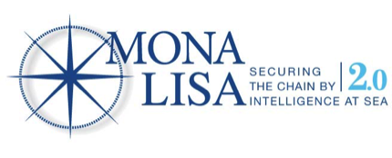

= Message exchange for flow management in maritime traffic management systems.
Thomas Borg Salling <tbsalling@tbsalling.dk>
v0.1, December 10, 2014: Document created
:keywords: imo, iala, ais, itu-r-1371
:toc-placement: preamble

Prepared for the http://dma.dk[Danish Maritime Authority] as part of the http://monalisaproject.eu/[MONA LISA 2] project.

image::images/dma.png[align="center", scaledwidth="25%"]

[abstract]
== Abstract
...

:numbered:

== Introduction
As part of and as a contribution to the MONA LISA 2.0 <<MONALISA2>> project the Danish Maritime Authority has worked to define message conversation scenarios and detailed message formats for _flow management_ in the context of _sea traffic management (STM)_ <<ARCH>>.

This paper documents the process and the the results, by
. defining the domain problem,
. establishing design criteria,
. proposing message conversation scenarios,
. defining message formats in different formats,
. introducing a reference implementation for AIS using application specific messages, and by
. supplying test data to validate its correctness.

The official point of contact for questions and comments is:

.Point of contact
****
Danish Maritime Authority +
_Dept. of Technology and Business Development_

M.Sc. Jens Kristian Jensen <JKJ@dma.dk>
****

== Design criteria
Since the 1990's, when AIS was first incepted, a large amount of work in the field maritime messaging has been performed. In order take advantage of lessons learned and other previous experiences, a number of design criteria for the current work have been defined. The proposed design and reference implementation on flow management support complies with each of these criteria. This will be validated in <<design_validation>>.

== Problem definition

=== Flow management

=== Use case 1:
[ditaa]
----
                   +-------------+
                   | Asciidoctor |-------+
                   |  Diagram    |       |
                   +-------------+       | PNG out
                       ^                 |
                       | ditaa in        |
                       |                 v
 +--------+   +--------+----+    /----------------\
 |        | --+ Asciidoctor +--> |                |
 |  Text  |   +-------------+    |Beautiful output|
 |Document|   |   !magic!   |    |                |
 |     {d}|   |             |    |                |
 +---+----+   +-------------+    \----------------/
     :                                   ^
     |          Lots of work             |
     +-----------------------------------+
----
=== Use case 2:

== Design of flow management support

=== High-level design
In the high-level design of support for flow management no assumptions are made about the characteristics of the underlying transport layer. Focus here, is to identify which pieces of information need to be exchanged, between whom, and when. Following this are detailed specifications for mapping this outcome to real-world protocols, such as AIS <<AISSPEC5>>.

=== Detailed message design
==== ASN.1
==== MSDL
==== AIS

=== Detailed conversation design

[[design_validation]]
=== Validation against design criteria

:numbered!:

[glossary]
== Glossary
MSDL
AIS
STM
VTS
STCC
IALA
ITU

[bibliography]
== Bibliography

=== Standards and specifications

[[[AISSPEC5]]] "Recommendation ITU-R M.1371-5: Technical characteristics for an automatic identification system using time division multiple access in the VHF maritime mobile frequency band". February, 2014. International Telecommunications Union. Available from http://www.itu.int/rec/R-REC-M.1371-5-201402-I.

[[[AISADMG]]] "Guidance on the use of AIS application-specific messages". Published as SN.1/Circ.289 by the International Maritime Organization (IMO). June 2, 2010.

[[[IALA144]]] "IALA Recommendation e-NAV - 144 On Harmonized implementation of Application Specific Messages (ASM)". Edition 1. June, 2011. International Association of Marine Aids to Navigation and Lighthouse Authorities.

=== Articles, blogs and papers

[[[TOILS]]] "The Toils of AIS: A Case Study in Application Protocol Design And Analysis" by Eric S. Raymond and Kurt Schwehr. 2013. Available from http://gitorious.org/toils-of-ais/toils-of-ais/

[[[ARCH]]] "Architecture for STM in EMSN and STM Data format for Route Exchange".

=== Web resources

[[[ASN.1]]] "Abstract Syntax Notation One (ASN.1)". A standard and notation that describes rules and structures for representing, encoding, transmitting, and decoding data in telecommunications and computer networking. http://en.wikipedia.org/wiki/Abstract_Syntax_Notation_One.

[[[BDEC]]] "bdec". A set of tools for creating decoders and encoders for binary files given a high level specification. http://www.protocollogic.com/docs/tutorial.html.

[[[MONALISA2]]] "MONALISA 2.0". A joint project from 10 different countries in the European Union to introduce Sea Traffic Management (STM) and make real-time information available to all interested and authorised parties in the maritime world. http://monalisaproject.eu/.

[appendix]
== Appendix
